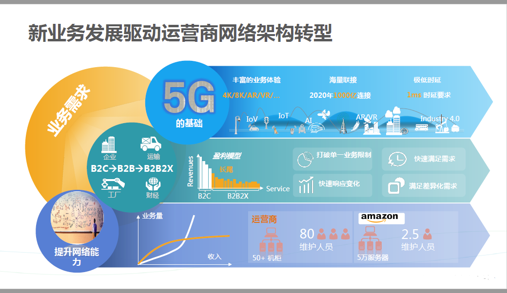

# NFV概述与实战开发
* 目录
* [1什么是NFV](#1)
* [1.1NFV发展背景](#1.1)
* [2. NFV开发](#2)

## <h2 id="1">一、什么是NFV</h2>
### 1.NFV发展背景

    移动智能设备、物联网、M2M(机器对机器)连接的增加
        |
    移动数据流量暴发式增长
        |
    网络运营商部署大量昂贵的专用设备 || 开发新的设备
        |
        
### 1.什么是NFV
    > NFV，即网络功能虚拟化，Network Function Virtualization。
      NFV是利用IT虚拟化技术将现有的网络设备功能整合进标准的服务器、存储和交换机等设备，以软件的形式实现网络功能，以此取代目前网络中私有、专用和封闭的网元设备。  
      电信网络将借助NFV技术提高网络设备利用率，降低运营商OPEX/CAPEX支出，加快业务创新的步伐，为用户带来更佳的业务使用体验，以此构造一个有竞争力的、创新的开放生态系统。
### 2.为什么会出现NFV
    图一
    NFV是5G网络的基础
### 3.NFV好处
- 加快产品和新业务推向市场的速度，因为无需改变硬件，要知道，硬件修改要费尽的多，开发测试周期太长。      
- 由于标准化的作用，带来采购，设计，集成和基础设施的维护的过程大大简化；
- 由于有了动态分配硬件资源的能力，可以在确定的时间增加网络功能，从而增加了灵活性/扩展；
## 二、NFV架构介绍
### 1.总架构
### 2.NFV实例部署图
## <h2 id="2">三、NFV开发</h2>
### 1.C10接口开发
### 2.镜像制作
### 3.模板配置
## 四、完整流程
