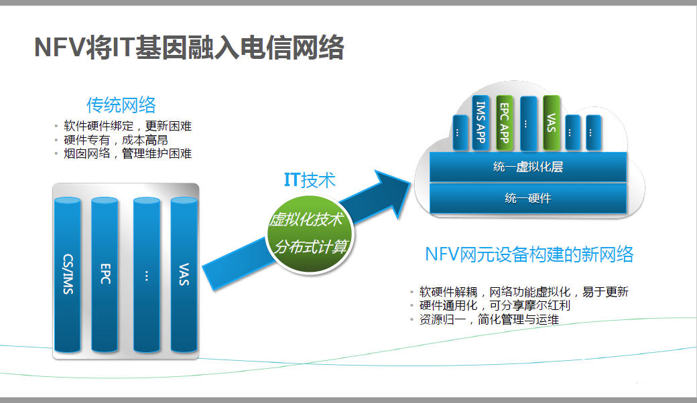

# NFV概述与实战开发
- 目录
- [1.NFV概述](#1)
  - [1.1NFV发展背景](#1.1)
  - [1.2什么是NFV](#1.2)
  - [1.3NFV优势](#1.3)
- [2.NFV开发](#2)

## <h2 id="1">1.NFV概述</h2>
### <h3 id="1.1">1.1NFV发展背景</h2>
- a) 新型网络业务迅速发展导致流量急速增加（IoV、IoT、AI、VR等）
- b）运营商部署大量专用网络设备满足需求（专用设备软硬件一体化、扩展受限且设备管理低效）
- c) 新增网络服务时，需开发新设备（周期漫长，且需提供机房空间、供电及维护等）
- d) 运营商业务量增幅与业务收入增幅出现“剪刀差”,同时CAPEX/OPEX不断上升
- e) 互联网OTT(Over The Top)业务的大规模发展，导致运营商收入大幅度减少。
- f）为获取一种低成本、高收入的运营方式，网络运营商们提出了NFV

### <h3 id="1.2">1.2什么是NFV</h3>
    > NFV，即网络功能虚拟化，Network Function Virtualization。
      NFV是利用IT虚拟化技术将现有的网络设备功能整合进标准的服务器、存储和交换机等设备，以软件的形式实现网络功能，以此取代目前网络中私有、专用和封闭的网元设备。  
      电信网络将借助NFV技术提高网络设备利用率，降低运营商OPEX/CAPEX支出，加快业务创新的步伐，为用户带来更佳的业务使用体验，以此构造一个有竞争力的、创新的开放生态系统。
      
### <h3 id="1.3">1.3NFV优势</h3>
- 1.3.1工业标准硬件
    - 降低设备更新周期
    - 降低设备成本
    - 标准设备易于维护
    - 直接降低OPEX/CAPEX
- 1.3.2网络功能软件
    - 缩短新应用开发周期
    - 降低实验阶段成本价格
    - 提高新业务、新应用失败容忍度
    - 虚拟资源代替物理设备，节省能源、空间
    - 自动化管理应用，降低运维管理成本
    - 软硬件解耦，灵活部署，加快业务推向市场
    - 自动弹性扩缩容
- 总的来说，降低OPEX和CAPEX，同时加速创新步伐。

## 二、NFV架构介绍
### 1.总架构
### 2.NFV实例部署图
## <h2 id="2">三、NFV开发</h2>
### 1.C10接口开发
### 2.镜像制作
### 3.模板配置
## 四、完整流程
